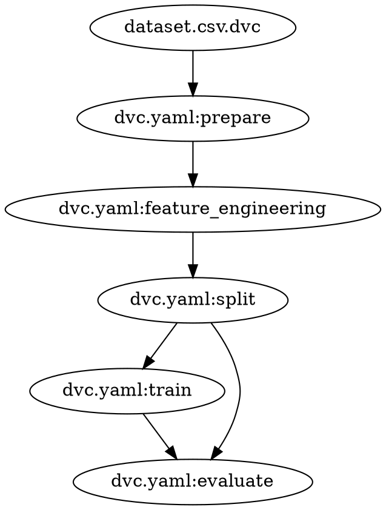

# DVC — Data Version Control
## Complete Documentation for the MLOps Project

---

## Table of Contents

1. [What is DVC?](#what-is-dvc)
2. [Why DVC Exists — The Problem It Solves](#why-dvc-exists)
3. [Core Architecture](#core-architecture)
4. [Key Concepts](#key-concepts)
5. [DVC vs Git — How They Work Together](#dvc-vs-git)
6. [Pipeline Architecture in This Project](#pipeline-architecture-in-this-project)
7. [File-by-File Breakdown](#file-by-file-breakdown)
8. [Pipeline DAG — How Stages Connect](#pipeline-dag)
9. [How DVC Detects Changes](#how-dvc-detects-changes)
10. [Remote Storage](#remote-storage)
11. [Metrics and Experiment Tracking](#metrics-and-experiment-tracking)
12. [run_dvc.sh — What It Does Step by Step](#run_dvcsh)
13. [Common DVC Commands](#common-dvc-commands)
14. [How DVC Connects to Other Tools](#how-dvc-connects-to-other-tools)

---

## What is DVC?

DVC (Data Version Control) is an open-source tool that brings Git-like version control to machine learning data, models, and pipelines. While Git tracks source code, DVC tracks the large binary files that ML workflows produce — CSV datasets, trained model weights, feature matrices — and the reproducible pipelines that generate them.

DVC does not replace Git. It runs alongside Git, using Git to store metadata (`.dvc` pointer files, `dvc.lock`, `dvc.yaml`) while storing the actual large files in a separate storage backend called a **remote**.

---

## Why DVC Exists

Machine learning projects have problems that Git alone cannot solve:

**Git cannot store large files.** A 300MB `model.pkl` or a multi-gigabyte training dataset cannot be committed to a Git repository. DVC stores these files in a content-addressed cache and pushes them to a remote (local disk, S3, GCS, Azure Blob), while Git only stores a tiny `.dvc` pointer file.

**Experiments are not reproducible without tracking inputs.** If you retrain a model two weeks later, you may not know which dataset version, which code version, and which hyperparameters produced the original result. DVC's `dvc.lock` file records the exact MD5 hash of every input and output so any past run can be reproduced exactly.

**Pipeline stages are run manually in the wrong order.** DVC's `dvc repro` command reads the dependency graph from `dvc.yaml` and runs only the stages whose inputs have changed, in the correct order, skipping everything else. This makes re-runs fast and reliable.

**Team members cannot share data easily.** With DVC, `dvc push` uploads data to a shared remote and `dvc pull` downloads it. Everyone works with the same data version that corresponds to the current Git commit.

---

## Core Architecture

```
┌─────────────────────────────────────────────────────────────┐
│                        Git Repository                       │
│  .dvc/config        ← remote storage configuration          │
│  dvc.yaml           ← pipeline stage definitions            │
│  dvc.lock           ← locked input/output hashes            │
│  ml/data/raw/dataset.csv.dvc  ← pointer to raw data         │
│  ml/configs/params.yaml       ← hyperparameters             │
└─────────────────────────────────────────────────────────────┘
                              │
                              │ references
                              ▼
┌─────────────────────────────────────────────────────────────┐
│                       DVC Cache (.dvc/cache/)               │
│  Content-addressed store: files indexed by MD5 hash         │
│  ab/cdef1234...  ← actual bytes of dataset.csv              │
│  08/2aebb29a...  ← actual bytes of model.pkl                │
└─────────────────────────────────────────────────────────────┘
                              │
                              │ push / pull
                              ▼
┌─────────────────────────────────────────────────────────────┐
│                        DVC Remote                           │
│  Local:  /tmp/dvc-storage  (used in this project)           │
│  Cloud:  s3://bucket/dvc   (production)                     │
│          gs://bucket/dvc                                    │
│          azure://container/dvc                              │
└─────────────────────────────────────────────────────────────┘
```

When you run `dvc repro`, DVC reads `dvc.yaml` to understand the pipeline, checks `dvc.lock` to see what changed, runs only the affected stages, updates the cache with new outputs, and writes a new `dvc.lock`.

---

## Key Concepts

### Stage
A single step in the ML pipeline. Defined in `dvc.yaml` with a command (`cmd`), dependencies (`deps`), parameters (`params`), and outputs (`outs`). Each stage is independently cacheable.

### Dependency (`deps`)
A file or directory that a stage reads. If a dependency's MD5 hash changes, DVC marks the stage as stale and reruns it on the next `dvc repro`.

### Output (`outs`)
A file or directory that a stage produces. DVC caches outputs by their MD5 hash so they can be restored later without rerunning the stage.

### Parameter (`params`)
A value read from a YAML config file (in this project, `ml/configs/params.yaml`). If a parameter changes, DVC marks the dependent stage as stale. Parameters are tracked separately from deps so you can change a hyperparameter without changing any code file.

### Metrics
A special output type (declared with `metrics:` instead of `outs:`) that DVC knows how to read and display as a table. In this project, `eval_metrics.json` is declared as a metric so `dvc metrics show` can display accuracy and F1.

### Remote
External storage where DVC pushes cached files so team members can pull them. Configured with `dvc remote add`. In this project the remote is a local directory at `/tmp/dvc-storage`, which would be replaced with an S3 bucket in production.

### dvc.lock
A machine-generated file that records the exact state of every stage after a successful `dvc repro` run. Contains the MD5 hash, size, and path of every dependency, parameter value, and output. This is what makes runs reproducible — checking out a Git commit and running `dvc checkout` restores every data file to the exact state it was in when that commit was made.

### .dvc pointer file
A small text file (like `dataset.csv.dvc`) committed to Git in place of the actual data file. It contains only the MD5 hash of the real file. When someone runs `dvc pull`, DVC reads this hash and downloads the matching file from the remote.

---

## DVC vs Git — How They Work Together

| Concern | Git | DVC |
|---|---|---|
| Source code (`.py`, `.sh`, `.yaml`) | ✅ Tracks | — |
| Pipeline definitions (`dvc.yaml`) | ✅ Tracks | — |
| Locked hashes (`dvc.lock`) | ✅ Tracks | — |
| Hyperparameters (`params.yaml`) | ✅ Tracks | ✅ Reads for change detection |
| Raw data (CSV, Parquet) | ❌ Too large | ✅ Caches + remote |
| Trained model (`model.pkl`) | ❌ Binary blob | ✅ Caches + remote |
| Feature matrices (train/test CSV) | ❌ Too large | ✅ Caches + remote |
| Experiment metrics | — | ✅ `dvc metrics show` |

A typical workflow looks like this:

```
git checkout experiment-branch   # switch code version
dvc pull                         # restore matching data version
dvc repro                        # rerun only changed stages
git add dvc.lock
git commit -m "new experiment"
dvc push                         # share data with team
git push
```

---

## Pipeline Architecture in This Project

The project defines a five-stage pipeline in `ml/pipelines/dvc/dvc.yaml`. The pipeline transforms raw data all the way to a trained, evaluated model:

```
ml/data/raw/dataset.csv  (tracked by dataset.csv.dvc)
           │
           ▼
     ┌──────────┐
     │ prepare  │  app/src/prepare.py
     │          │  Drops nulls, normalises column names
     └──────────┘
           │
           ▼  ml/data/processed/dataset.csv
     ┌─────────────────────┐
     │ feature_engineering │  app/src/features.py
     │                     │  StandardScaler, OneHotEncoder
     └─────────────────────┘
           │
           ▼  ml/data/features/features.csv
        ┌───────┐
        │ split │  app/src/split.py
        │       │  80/20 train-test split
        └───────┘
         │     │
         │     └──────────────────────┐
         ▼                            ▼
  ml/data/features/train.csv   ml/data/features/test.csv
         │                            │
         ▼                            │
      ┌───────┐                       │
      │ train │  training_flow.py     │
      │       │  RandomForest         │
      └───────┘                       │
         │                            │
         ▼  ml/models/artifacts/model.pkl
      ┌──────────┐◄────────────────────┘
      │ evaluate │  app/src/evaluate.py
      │          │  accuracy, F1, quality gates
      └──────────┘
         │
         ▼  ml/models/artifacts/eval_metrics.json
```

---

## File-by-File Breakdown

### `ml/pipelines/dvc/dvc.yaml` — Pipeline Definition

This is the central configuration file that defines every stage. DVC reads it to understand what to run, in what order, and with what inputs and outputs.

**`prepare` stage**
```yaml
prepare:
  desc: Clean raw dataset and generate processed dataset
  wdir: ../../../
  cmd: python app/src/prepare.py
  deps:
    - app/src/prepare.py
    - ml/data/raw/dataset.csv
  params:
    - dataset.raw_path
    - dataset.processed_path
  outs:
    - ml/data/processed/dataset.csv
```
Runs `prepare.py` which reads the raw CSV, drops rows with null values, and normalises all column names to lowercase with underscores. The stage reruns if `prepare.py` changes, if `dataset.csv` changes, or if the `raw_path` or `processed_path` parameters change.

**`feature_engineering` stage**
```yaml
feature_engineering:
  cmd: python app/src/features.py
  deps:
    - app/src/features.py
    - ml/data/processed/dataset.csv
  params:
    - features
    - dataset.features_path
  outs:
    - ml/data/features/features.csv
```
Runs `features.py` which applies StandardScaler to numeric columns and OneHotEncoder to categorical columns. The `features` parameter block covers encoding and scaling configuration, so changing these settings in `params.yaml` automatically triggers a rerun.

**`split` stage**
```yaml
split:
  cmd: python app/src/split.py
  deps:
    - app/src/split.py
    - ml/data/features/features.csv
  params:
    - dataset.test_size
    - dataset.random_state
    - dataset.train_path
    - dataset.test_path
  outs:
    - ml/data/features/train.csv
    - ml/data/features/test.csv
```
Runs `split.py` which uses `train_test_split` with `test_size=0.2` and `random_state=42`. Tracking `random_state` as a DVC parameter means changing the seed triggers a full resplit and retrain, ensuring results are always reproducible for the declared seed.

**`train` stage**
```yaml
train:
  cmd: python ml/pipelines/metaflow/training_flow.py run
  deps:
    - ml/pipelines/metaflow/training_flow.py
    - ml/data/features/train.csv
  params:
    - model
    - training.model_output
  outs:
    - ml/models/artifacts/model.pkl
```
This is the only stage that delegates to another orchestrator — Metaflow. DVC treats the `training_flow.py run` command as a black box: it only cares that `train.csv` went in and `model.pkl` came out. The `model` parameter block (n_estimators, max_depth, random_state) means changing any hyperparameter in `params.yaml` invalidates the cached model and forces a retrain.

**`evaluate` stage**
```yaml
evaluate:
  cmd: python app/src/evaluate.py
  deps:
    - app/src/evaluate.py
    - ml/models/artifacts/model.pkl
    - ml/data/features/test.csv
  metrics:
    - ml/models/artifacts/eval_metrics.json
```
Runs `evaluate.py` which loads `model.pkl`, runs it on `test.csv`, and writes `eval_metrics.json` with accuracy, F1, and quality gate results. Note the use of `metrics:` instead of `outs:` — this tells DVC to expose these values through `dvc metrics show` and `dvc metrics diff`.

---

### `ml/pipelines/dvc/dvc.lock` — Locked Run State

This file is auto-generated by DVC after every successful `dvc repro`. It records the exact MD5 hash and byte size of every file involved in the pipeline. This is the reproducibility guarantee.

From the project's `dvc.lock`:

```yaml
prepare:
  deps:
  - path: ml/data/raw/dataset.csv
    md5: bbdf63b126e5f7c55bdd9be7d9d61379
    size: 29820
  outs:
  - path: ml/data/processed/dataset.csv
    md5: 51038663b75a5393efafce9489633dd3
    size: 29431

train:
  outs:
  - path: ml/models/artifacts/model.pkl
    md5: 082aebb29a5bb5abdb895f5898578285
    size: 317958
```

If you check out this Git commit a year from now, run `dvc pull`, and then `dvc repro`, DVC will verify that `dataset.csv` still has MD5 `bbdf63b...` before running `prepare`, and it will know the expected output `model.pkl` should have MD5 `082aebb...`. If any hash mismatches, DVC reruns the affected stages. This makes every experiment fully auditable.

---

### `ml/data/raw/dataset.csv.dvc` — Data Pointer File

This small file is committed to Git in place of the actual 29KB CSV. It tells DVC where to find the real file:

```yaml
outs:
- md5: bbdf63b126e5f7c55bdd9be7d9d61379
  size: 29820
  path: dataset.csv
```

When a team member runs `dvc pull`, DVC reads this hash and downloads the matching file from the remote. The actual `dataset.csv` is listed in `.gitignore` so Git never tries to track it.

---

### `ml/configs/params.yaml` — Hyperparameters Tracked by DVC

```yaml
dataset:
  test_size: 0.2
  random_state: 42

model:
  type: RandomForestClassifier
  n_estimators: 100
  max_depth: 5
  random_state: 42
```

DVC reads specific keys from this file as declared in `dvc.yaml`. If you change `n_estimators` from 100 to 200, DVC marks the `train` and `evaluate` stages as stale on the next `dvc repro` and reruns them. You can then compare results with `dvc metrics diff` to see whether the change improved accuracy. This creates a lightweight experiment tracking loop without a separate experiment tracking server.

---

### `ml/pipelines/dvc/pipeline_dag.dot` — Visual Pipeline Graph

Auto-generated by `dvc dag --dot`. Contains a Graphviz DOT representation of the pipeline dependency graph. In this project:



The key insight from this graph is that `split` feeds into **both** `train` and `evaluate`. This means `evaluate` depends on two upstream stages: `train` (for the model) and `split` (for the test set). DVC handles this multi-parent dependency automatically.

Render the graph with:
```bash
dot -Tpng ml/pipelines/dvc/pipeline_dag.dot -o dag.png
```

---

## Pipeline DAG

The Directed Acyclic Graph that DVC builds from `dvc.yaml`:

```
dataset.csv.dvc
      │
      ▼
   prepare ──────────────────────────────────────────────────┐
      │                                                       │
      ▼                                                    (dep)
feature_engineering                                           │
      │                                                       │
      ▼                                                       │
    split ─────────────────────────────────────┐             │
      │                                        │             │
      ▼ (train.csv)                            ▼ (test.csv)  │
    train ──────────────────────► evaluate ◄───┘             │
      │ (model.pkl)                   ▲                      │
      └───────────────────────────────┘                      │
                                      │                      │
                                      └─── eval_metrics.json │
                                                             │
                            (prepare.py also listed as dep) ─┘
```

**Why this shape matters:** `evaluate` sits at the end of two paths:
- `split → train → evaluate` (model path)
- `split → evaluate` (test data path)

This means if only the model changes (e.g., you tuned a hyperparameter), DVC reruns `train` and `evaluate` but skips `prepare`, `feature_engineering`, and `split` because their inputs did not change. This makes iteration fast.

---

## How DVC Detects Changes

DVC uses MD5 hashing, not file timestamps, to detect whether a stage needs to rerun. This is more reliable than timestamps, which change when files are copied or touched.

The change detection logic for each run:

1. Read `dvc.lock` to get the last known MD5 of every dependency and output.
2. Compute the current MD5 of each dependency file.
3. Compare the current hash to the locked hash.
4. If any dependency hash changed, mark the stage as stale.
5. If a stage is stale, mark all downstream stages as stale too (cascading invalidation).
6. Run all stale stages in topological order.
7. After each stage completes, compute the MD5 of its outputs and write them to `dvc.lock`.

In the project output you saw this working:
```
'ml/data/raw/dataset.csv.dvc' didn't change, skipping
Stage 'dvc.yaml:prepare' didn't change, skipping
Stage 'dvc.yaml:train' didn't change, skipping
```

All five stages were skipped because none of the inputs — code files, data files, or params — had changed since the last run. The pipeline completed in seconds instead of minutes.

---

## Remote Storage

In this project, DVC is configured with a local directory remote:

```bash
dvc remote add -d localremote /tmp/dvc-storage
```

This means all cached files are pushed to `/tmp/dvc-storage` on the same machine. In production this would be replaced with:

```bash
# AWS S3
dvc remote add -d s3remote s3://your-bucket/dvc

# Google Cloud Storage
dvc remote add -d gcsremote gs://your-bucket/dvc

# Azure Blob Storage
dvc remote add -d azremote azure://your-container/dvc
```

The remote configuration is stored in `.dvc/config` which is committed to Git. Secret credentials (S3 keys, GCS service accounts) are stored in `.dvc/config.local` which is gitignored.

When `run_dvc.sh` runs `dvc push`, it uploads 7 files to the remote — the raw dataset, processed dataset, feature CSVs (train and test), features CSV, the model pickle, and the metrics JSON. When a team member clones the repository and runs `dvc pull`, they get all 7 files back at exactly the versions that match the current Git commit.

---

## Metrics and Experiment Tracking

DVC provides lightweight experiment comparison without requiring MLflow or any external service.

After `dvc repro` runs the `evaluate` stage, the metrics are available:

```bash
dvc metrics show
```

Output in this project:
```
Path                                   accuracy    f1      min_accuracy    min_f1    passed_gates
ml/models/artifacts/eval_metrics.json  0.41        0.3612  0.0             0.0       True
```

To compare metrics between Git commits or DVC experiments:
```bash
# Compare current run to the previous Git commit
dvc metrics diff HEAD~1

# Compare two named experiments
dvc exp show
```

To create a named experiment snapshot:
```bash
dvc exp save --name "baseline-100trees"
# Change params.yaml: n_estimators: 200
dvc repro
dvc exp save --name "deeper-200trees"
dvc exp show   # side-by-side comparison table
```

Note: `dvc exp save` requires at least one Git commit in the repository, which is why `run_dvc.sh` shows the warning `Experiment save skipped (dvc exp requires Git commit)` on first run.

---

## run_dvc.sh — What It Does Step by Step

The script at `ml/pipelines/dvc/run_dvc.sh` orchestrates the full DVC lifecycle in nine steps:

**Step 1 — Install DVC** if not already available. Creates a `.venv` virtual environment and installs `dvc[all]`, `metaflow`, `scikit-learn`, `pandas`, `pyyaml`, and `joblib`. The `dvc[all]` extra installs support for all remote backends (S3, GCS, Azure, SSH).

**Step 2 — Initialise DVC** by running `dvc init` if `.dvc/` does not exist. This creates the cache directory and config file. Stages `git add .dvc .gitignore` so the DVC infrastructure is committed.

**Step 3 — Configure remote storage** by adding `/tmp/dvc-storage` as the default remote if it is not already configured. This is the local fallback remote used in development.

**Step 4 — Pull data** with `dvc pull --force`. On first run this is a no-op because the remote is empty. On subsequent runs this restores cached data files that match the current Git commit.

**Step 5 — Validate the pipeline** by generating a DOT-format DAG with `dvc dag --dot`. This confirms the pipeline structure is valid before running it.

**Step 6 — Run the pipeline** with `dvc repro`. This is the core step. DVC reads `dvc.yaml`, checks `dvc.lock`, and runs only the stages whose inputs have changed. The output you see — `didn't change, skipping` — is DVC's cache working correctly.

**Step 7 — Show metrics** with `dvc metrics show`. Reads `eval_metrics.json` and renders a table of accuracy and F1 scores.

**Step 8 — Save experiment snapshot** with `dvc exp save`. Creates a named snapshot of the current params and metrics that can be compared to future runs.

**Step 9 — Push data** with `dvc push`. Uploads all cached outputs to the remote so they are available to other team members or CI/CD environments.

---

## Common DVC Commands

| Command | What It Does |
|---|---|
| `dvc init` | Initialise DVC in the current Git repo |
| `dvc repro` | Rerun stale pipeline stages in order |
| `dvc repro --force` | Rerun all stages regardless of cache |
| `dvc status` | Show which stages are stale |
| `dvc pull` | Download cached files from remote |
| `dvc push` | Upload cached files to remote |
| `dvc checkout` | Restore data files to match current dvc.lock |
| `dvc metrics show` | Display metrics from the last pipeline run |
| `dvc metrics diff` | Compare metrics between commits |
| `dvc params diff` | Show which params changed between commits |
| `dvc dag` | Print the pipeline dependency graph |
| `dvc dag --dot` | Output graph in Graphviz DOT format |
| `dvc exp save --name X` | Save a named experiment snapshot |
| `dvc exp show` | Compare all saved experiments in a table |
| `dvc exp run` | Run a new experiment with param overrides |
| `dvc remote add` | Add a new storage remote |
| `dvc remote list` | List configured remotes |
| `dvc add <file>` | Start tracking a file with DVC |

---

## How DVC Connects to Other Tools

**Metaflow** — The `train` stage in `dvc.yaml` calls `training_flow.py run`. DVC does not know or care that Metaflow is running inside this command. It simply executes the command and hashes the output `model.pkl`. Metaflow handles the multi-step training logic (start → train → end), while DVC handles the pipeline orchestration and caching.

**MLflow** — After DVC produces `eval_metrics.json`, `deploy_mlflow.sh` reads this file to decide whether to promote the model to Production in the MLflow Model Registry. DVC and MLflow have complementary roles: DVC ensures reproducibility and data versioning, MLflow manages model lifecycle stages.

**Prefect** — The Prefect retraining flow checks the Evidently drift report and, if drift is detected, triggers the Metaflow training pipeline. DVC sits upstream of this loop: when the drift-triggered retrain produces a new `model.pkl`, DVC's `dvc push` would capture the new version.

**Evidently** — Evidently reads `ml/data/processed/dataset.csv` (produced by DVC's `prepare` stage) as the reference dataset for drift detection. DVC ensures this file is always the exact version that matches the trained model.

**FastAPI** — The application loads `ml/models/artifacts/model.pkl` at startup. DVC guarantees that this file corresponds to the training run described in `dvc.lock`. If a team member checks out a different Git commit and runs `dvc pull`, the application will load the model that was actually trained on that commit's data and code.

**OpenLineage** — DVC's pipeline graph (prepare → feature_engineering → split → train → evaluate) maps directly to the lineage graph emitted by `lineage_emitter.py`. DVC provides the structural definition of data flow; OpenLineage records the runtime events.

---

## Summary

DVC acts as the foundation of reproducibility in this MLOps project. Every other tool — Metaflow, MLflow, Prefect, Feast, Evidently — operates on artifacts that DVC has versioned and whose provenance DVC has recorded. The combination of `dvc.yaml` (pipeline definition), `dvc.lock` (locked state), and the remote (shared storage) means that any run of this pipeline, on any machine, at any point in time, can be reproduced exactly by checking out the corresponding Git commit and running `dvc pull && dvc repro`.